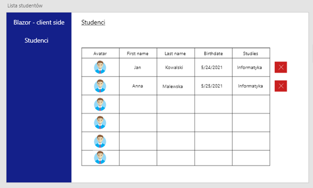
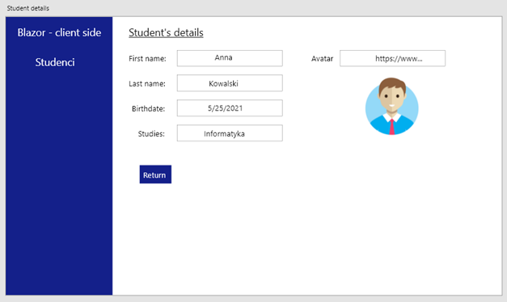

# Ćwiczenia11

Stwórz nową aplikację wykorzystując framework Blazor – **server side** i stwórz ekrany zgodne z makietą zaprezentowaną poniżej.

Aplikacja na ten moment może wykorzystywać **statyczną** listę studentów jako źródło danych – nie łączymy się jeszcze do realnego źródła danych.

Implementując ekran prezentujący tabelę z danymi studentów – pamiętaj o dodanie możliwości sortowania. Liczbę elementów na stronie możesz ustawić na 10.

Kliknięcie na nagłówek kolumny powinno pozwolić na posortowanie danych (malejąco lub rosnąco).

Podczas usuwania rekordu spróbuj wyświetlić okno pozwalające na potwierdzenie usunięcia (tak/nie) – wykorzystaj do tego funkcję **confirm** (JavaScript).

## Makieta

