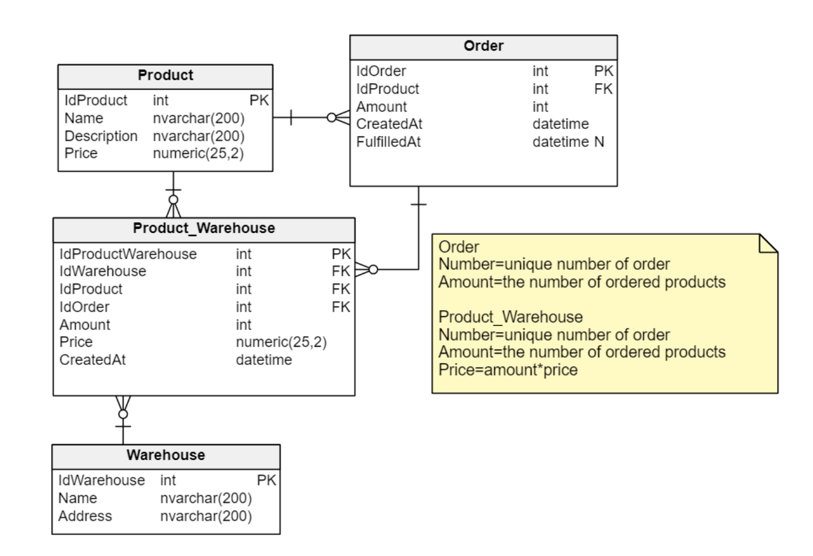

[](https://classroom.github.com/a/jzHDb6Ds)
# Ćwiczenia5

W trakcie niniejszych ćwiczeń ponownie skorzystamy z klas SqlConnection i SqlCommand. Tym razem logika związana z interakcją z naszą bazą danych będzie jednak nieco bardziej złożona. Tworzymy aplikację dla firmy zajmującej się zarządzaniem stanem magazynu i produktami, które się w nim znajdują.

## Baza danych

Baza, którą wykorzystujemy zaprezentowana jest poniżej.



Ponadto w pliku **create.sql** znajdziecie skrypt, który tworzy tabele i wypełnia je danymi.

## Wymogi zadania

1. Dodaj kontroler o nazwie **WarehousesController**
2. Wewnątrz kontrolera dodaj końcówkę, które będzie odpowiadać na następujące żądanie:

   - Końcówka odpowiada na żądanie **HTTP POST na adres /api/warehouses**
   - Końcówka otrzymuje dane następującej postaci:

   ```JSON
   {
      "idProduct": 1,
      "idWarehouse": 1,
      "amount": 125,
      "createdAt": "2023-04-04T13:37:13.377Z"
   }
   ```

   - Wszystkie pola są wymagane. Amount musi być większe niż 0.

3. Końcówka powinna zrealizować następujący scenariusz działania.
   | Nazwa | Rejestracja produktów w hurtowni |
   | :-----: | :------------------------------------------------------------------------------------------------------------------------------------------------------------------------------------------------------------------------------------------------------------------------------------------------------------------------------------------------------------------------: |
   | | Scenariusz główny |
   | 1. | Sprawdzamy czy **produkt** oraz **hurtownia** o podanym id istnieje. Ponadto upewniamy się, że wartość Amount jest większa od 0. |
   | 2. | Produkt możemy dodać do hurtowni tylko jeśli w tabeli Order istnieje zlecenie zakupu produktu. Sprawdzamy zatem czy w tabeli Order istnieje rekord z: IdProduct i Amount zgodnym z naszym żądaniem oraz wartością FulfilledAt równą NULL. CreatedAt zamówienia powinno być mniejsze niż CreatedAt pochodzące z naszego żądania (zamówienie/order powinno pojawić się w bazie danych wcześniej niż nasze żądanie) |
   | 3. | Aktualizujemy kolumnę FullfilledAt zlecenia w wierszu oznaczającym zlecenie zgodnie z aktualną datą i czasem. (UPDATE) |
   | 4. | Wstawiamy rekord do tabeli Product_Warehouse. Kolumna Price powinna zawierać pomnożoną cenę pojedynczego produktu z wartością Amount z naszego żądania. Ponadto wstawiamy wartość CreatedAt zgodną z aktualną datą i czasem. (INSERT) |
   | 5. | Jako wynik operacji zwracamy wartość klucza głównego wygenerowanego dla rekordu wstawionego do tabeli Product_Warehouse. |

   | Nazwa |                            Rejestracja produktów w hurtowni                             |
   | :---: | :-------------------------------------------------------------------------------------: |
   |       |                                 Scenariusz alternatywny                                 |
   | 1a2.  | Produkt/Hurtownia o danym id nie istnieje. Zwracamy błąd 404 z odpowiednią wiadomością. |
   | 1a1.  |          Wartość Amount jest <= 0. Zwracamy kod 400 z odpowiednią wiadomością.          |
   |  2a.  |  Nie ma odpowiedniego zlecenia produktu. Zwracamy błąd 404 z odpowiednią wiadomością.   |

4. Następnie dodaj drugi kontroler **Warehouses2Controller** z końcówką odpowiadająca na żądania wysłane na adres **HTTP POST /api/warehouses2**

   - Końcówka realizuje tą samą logikę, ale w tym wypadku uruchamiana jest
     procedura składowana (załączona w pliku **proc.sql**).

## Podpowiedzi

- Do realizacji transakcji można skorzystać z klasy `TransactionScope` np.

  ```dotnet
  using(var scope = new TransactionScope(TransactionScopeAsyncFlowOption.Enabled)){}
  ```

  lub z klasy `SqlTransaction`, przykładowy kawałek kodu:

  ```dotnet
  var transaction = await connection.BeginTransactionAsync();
  SqlCommand command = connection.CreateCommand();
  command.Connection = connection;
  command.Transaction = transaction as SqlTransaction;
  ```

- Do walidacji minimalnej wartości można użyć adnotacji `[Range]`

## Uwagi

- Program powinien być napisany przy użyciu .NET7. Użycie innej wersji może skutkować utratą punktów
- Program, który się nie kompiluje - 0 pkt
- Należy pamiętać o **poprawnych** kodach HTTP. Niepoprawny kod HTTP jest równoznaczny z utratą punktów
- Należy pamiętać o obsłudze wyjątków
- Należy utworzyć poprawną strukturę aplikacji
- Program **musi** wykorzystywać programowanie asynchroniczne **(async/await)**
- Komunikacja z bazą danych powinna odbywać się poprzez klasy **SqlConnection/SqlCommand**.
