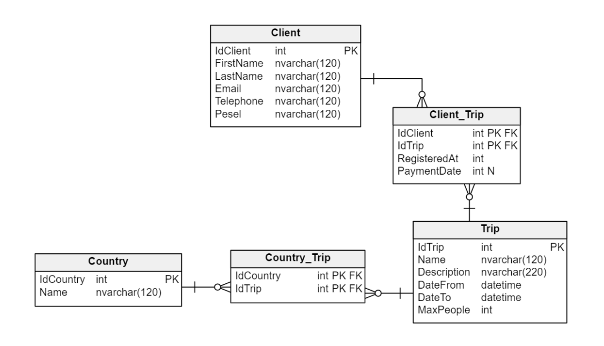

[](https://classroom.github.com/a/a9wy0NE_)
# Ćwiczenia7

W niniejszym zadaniu skorzystamy z biblioteki **EntityFramework Core**.

## Baza danych

Poniżej przedstawiony jest diagram na którym będziemy pracować.



## Wymogi zadania

1. Stwórz aplikację typu REST Api.
2. Przygotuj końcówkę zwracającą dane z pomocą EntityFramework Core zgodnie z poniższymi informacjami:
   a. Końcówkę odpowiadającą na żądania **HTTP GET** wysyłane na adres `/api/trips`
   b. Końcówka powinna zwrócić listę podróży w kolejności **posortowanej** **malejącą** po dacie rozpoczęcia wycieczki.
   c. Poniżej przedstawiony przykładowy format zwróconych danych.

   ```json
   [
     {
       "name": "ABC",
       "description": "Lorem ipsum...",
       "dateFrom": "2023-04-01T00:00:00",
       "dateTo": "2023-04-10T00:00:00",
       "maxPeople": 2,
       "countries": [
         {
           "name": "Poland"
         },
         {
           "name": "Germany"
         }
       ],
       "clients": [
         {
           "firstName": "John",
           "lastName": "Smith"
         },
         {
           "firstName": "Jake",
           "lastName": "Doe"
         }
       ]
     }
   ]
   ```

3. Przygotuj końcówkę pozwalającą na usunięcie danych klienta.
   a. Końcówka przyjmująca dane wysłane na adres **HTTP DELETE** na adres
   `/api/clients/{idClient}`
   b. Końcówka powinna najpierw sprawdzić czy klient nie posiada żadnych
   przypisanych wycieczek. Jeśli klient posiada co najmniej jedną przypisaną wycieczkę – zwracamy błąd i usunięcie nie dochodzi do skutku.

4. Przygotuj końcówkę pozwalającą na przypisanie klienta do wycieczki.
   a. Końcówka powinna przyjmować żądania **HTTP POST** wysłane na adres
   `/api/trips/{idTrip}/clients`
   b. Parametry przesłane w ciele żądania powinna wyglądać następująco (format danych może być inny):

   ```json
   {
     "firstName": "John",
     "lastName": "Doe",
     "email": "john@doe.com",
     "telephone": "543-323-542",
     "pesel": "91040294554",
     "tripID": 10,
     "tripName": "Rome",
     "paymentDate": "2023-04-10"
   }
   ```

   c. Po przyjęciu danych sprawdzamy:

   - Czy klient o danym numerze PESEL istnieje. Jeśli nie, dodajemy go do bazy
     danych.
   - Czy klient nie jest już zapisaną na wspomnianą wycieczkę – w takim
     wypadku zwracamy błąd
   - Czy wycieczka istnieje – jeśli nie – zwracamy błąd

   d. „PaymentDate” może posiadać wartość null, dla tych klientów, którzy jeszcze nie
   zapłacili za podróż. Ponadto kolumna „RegisteredAt” w tabeli Client_Trip
   powinna być równa aktualnemu czasowi przetworzenia żądania.

## Uwagi

- Program powinien być napisany przy użyciu .NET7. Użycie innej wersji może skutkować utratą punktów
- Program, który się nie kompiluje - 0 pkt
- Należy pamiętać o **poprawnych** kodach HTTP. Niepoprawny kod HTTP jest równoznaczny z utratą punktów
- Pamiętaj o poprawnych nazwach zmiennych/metod/klas
- Wykorzystaj dodatkowe modele dla danych zwracanych i przyjmowanych przez
  końcówki – DTO (ang. Data Transfer Object)
- Pamiętaj o SOLID, DI
