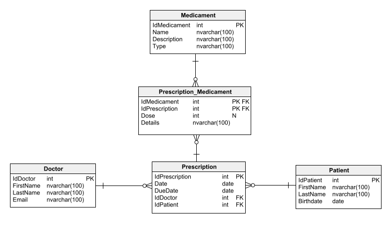

# Ćwiczenia8

Przygotuj nowy projekt aplikacji API i razem z EF i podejściem CodeFirst wygeneruj kilka migracji, która pozwolą nam stworzyć bazę danych przedstawioną na poniższym rysunku.

## Baza danych

Poniżej przedstawiony jest diagram na którym będziemy pracować.

## Wymogi zadania

1. Dodaj metodę seed’ującą bazę danych przykładowymi danymi.
2. Końcówkę, która pozwoli nam pobierać dane lekarze, dodawać nowego lekarza, modyfikować dane lekarza i usuwać lekarza (4 końcówki).
3. Dodaj końcówkę, która pozwoli nam pobrać konkretną receptę uwzględniając dane osobowe pacjenta, doktora i listę leków na recepcie.

## Uwagi

- Program powinien być napisany przy użyciu .NET7. Użycie innej wersji może skutkować utratą punktów
- Program, który się nie kompiluje - 0 pkt
- Należy pamiętać o **poprawnych** kodach HTTP. Niepoprawny kod HTTP jest równoznaczny z utratą punktów
- Pamiętaj o poprawnych nazwach zmiennych/metod/klas
- Wykorzystaj dodatkowe modele dla danych zwracanych i przyjmowanych przez
  końcówki – DTO (ang. Data Transfer Object)
- Pamiętaj o SOLID, DI
